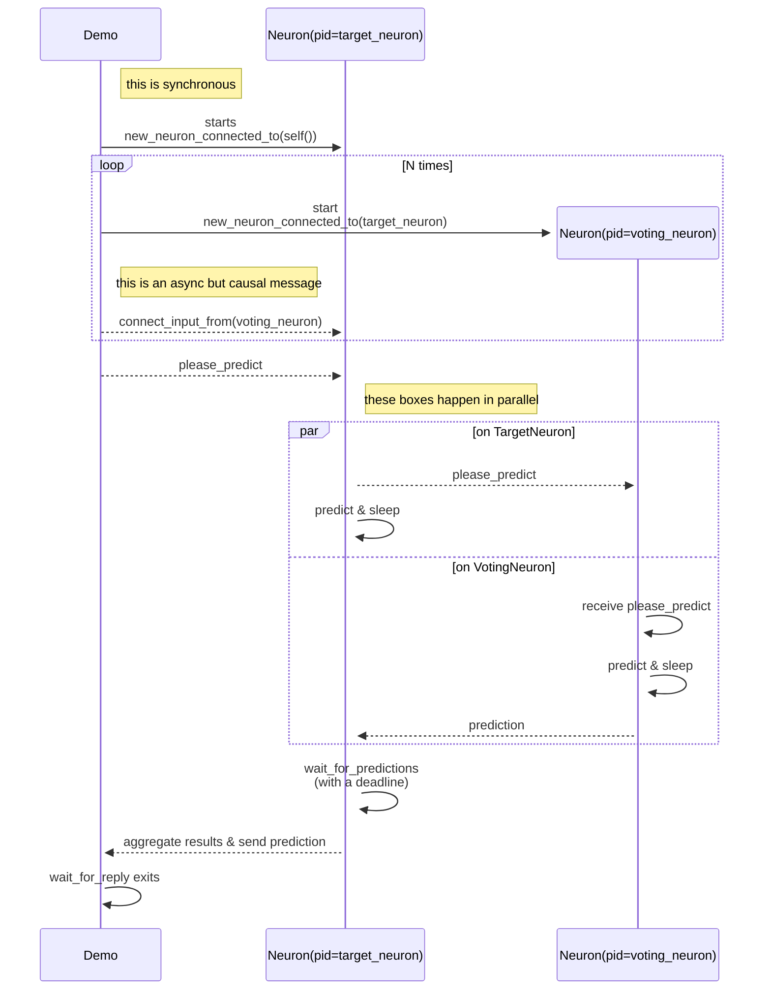

# elixir_ne

## structure



- Demo structure: [lib/demo.ex](lib/demo.ex)
  - a single "demo" neuron is instantiated
  - a `n==1000` neurons are started, knowing their target neuron
  - these are connected to the "demo" neuron
  - a prediction is requested (artificially), by sending the "demo" neuron a message
  - this in turn requests predictions from its connections
- Simulated voting neuron: [lib/neuron.ex](lib/neuron.ex)
  - if there are no connections, the neuron just returns a random number and sleeps a bit (`delay`)
  - if there are connections, the neuron tries to receive all the predictions, but within a deadline ("metabolic constraint"): `deadline_ms`
  - returns the maximal value received so far or `-1` if none were received within a timeout
  - *TODO*: return the best prediction if it's above a numeric threshold
  - deadline example: `{:prediction, %{delay: 142, input_count: 1000, prediction: [value: 65.30085608551246, reason: :deadline, inputs_used: 496]}}`
  - all received: `{:prediction, %{delay: 117, input_count: 1000, prediction: [value: 61.81215141710118, reason: :all_received, inputs_used: 1000]}`
  - none received within time limits: `{:prediction, %{delay: 101, input_count: 1000, prediction: [value: -1, reason: :deadline, inputs_used: 0]}}`
- written deliberately without [GenServer](https://hexdocs.pm/elixir/GenServer.html)s to demonstrate actual message passing that could be mapped onto neuron signalling
- see the build [output](https://github.com/d-led/elixir_ne/actions)
- run with: `mix run --no-halt`. Stop with `Ctrl+C` twice
  - requires [Elixir](https://elixir-lang.org/install.html) being installed
  - to run with more than 1000 neurons:

```shell
# increase maximum allowed processes
export ELIXIR_ERL_OPTIONS="+P 5000000"
time N_NEURONS=1000000 mix run
```

## distributed neurons

- start one shell with `iex --name a@127.0.0.1 -S mix`
- and another one with `iex --name b@127.0.0.1 -S mix`
  - ignore the initial unconnected run
- connect the nodes e.g. on `a`: `Node.connect(:'b@127.0.0.1')`
- make sure, the nodes are connected: `Node.list()`
- run the distributed demo: `Demo.start(:demo, [])`
- observe the result:

```shell
Neurons started on nodes: %{"a@127.0.0.1": 517, "b@127.0.0.1": 483}
received: {:prediction, %{delay: 149, input_count: 1000, prediction: [value: 63.243549425083664, reason: :deadline, inputs_used: 596]}}
```

- change the code if necessary and hot-code reload in the cluster before running again:
  `r [Demo, Neuron]; nl Demo; nl Neuron`

## ideas behind it

- brain has metabolic constraints: [Theriault et. al.: The sense of should: A biologically-based model of social pressure 10.31234/osf.io/x5rbs](https://psyarxiv.com/x5rbs/)
- neurons have thousands of synapses: [Hawkins & Ahmad: Why Neurons Have Thousands of Synapses, a Theory of Sequence Memory in Neocortex doi:10.3389/fncir.2016.00023](https://www.frontiersin.org/articles/10.3389/fncir.2016.00023/full)
- neurons might be voting on predictions [Hawkins et. al.: A Framework for Intelligence and Cortical Function Based on Grid Cells in the Neocortex doi:10.3389/FNCIR.2018.00121](https://numenta.com/neuroscience-research/research-publications/papers/thousand-brains-theory-of-intelligence-companion-paper/)
- neurons are physically parallel
- each neuron (or an aggregation of neurons for efficiency reason) can be represented by an [Erlang process](https://en.wikipedia.org/wiki/Erlang_(programming_language)#Erlang_Worldview)

## disclaimer

- I'm not a professional researcher
- this is a spare time project to play around with ideas
