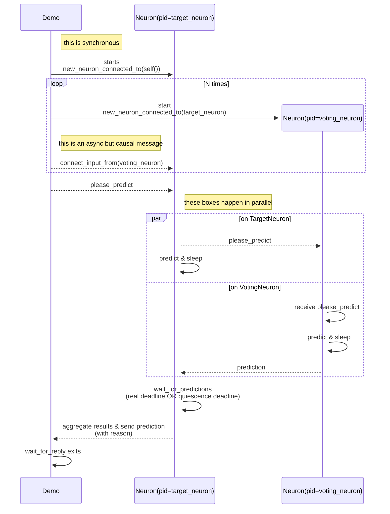

# elixir_ne

## structure


```mermaid
sequenceDiagram
    %% create participant TargetNeuron
    participant Demo
    participant TargetNeuron as Neuron(pid=target_neuron)
    Note right of Demo: this is synchronous
    Demo->>+TargetNeuron: starts <br> new_neuron_connected_to(self())
    loop N times
        create participant VotingNeuron as Neuron(pid=voting_neuron)
        Demo->>+VotingNeuron: start <br> new_neuron_connected_to(target_neuron)
        Note right of Demo: this is an async but causal message
        Demo-->>+TargetNeuron: connect_input_from(voting_neuron)
    end
    Demo-->>+TargetNeuron: please_predict
    note right of TargetNeuron: these boxes happen in parallel
    par on TargetNeuron
        TargetNeuron-->>+VotingNeuron: please_predict
        TargetNeuron->>TargetNeuron: predict & sleep
    and on VotingNeuron
        VotingNeuron->>+VotingNeuron: receive please_predict
        VotingNeuron->>+VotingNeuron: predict & sleep
        VotingNeuron-->>+TargetNeuron: prediction
    end
    TargetNeuron->>+TargetNeuron: wait_for_predictions <br> (real deadline OR quiescence deadline)
    TargetNeuron-->>+Demo: aggregate results & send prediction <br> (with reason)
    Demo->>+Demo: wait_for_reply exits
```

- Demo structure: [lib/demo.ex](lib/demo.ex)
  - requires [Elixir](https://elixir-lang.org/install.html) being installed
  - a single "demo" neuron is instantiated
  - a `n==1000` neurons are started, knowing their target neuron
  - these are connected to the "demo" neuron
  - a prediction is requested (artificially), by sending the "demo" neuron a message
  - this in turn requests predictions from its connections
- Simulated voting neuron: [lib/neuron.ex](lib/neuron.ex)
  - if there are no connections, the neuron just returns a random number and sleeps a bit (`delay`)
  - if there are connections, the neuron tries to receive all the predictions, but within a real deadline (`prediction_deadline_ms`)
  - in addition, it stops early on inactivity after `prediction_quiescence_deadline_ms` (defaults to `200`)
  - returns the maximal value received so far or `-1` if none were received before stopping
  - *TODO*: return the best prediction if it's above a numeric threshold
- written deliberately without [GenServer](https://hexdocs.pm/elixir/GenServer.html)s to demonstrate actual message passing that could be mapped onto neuron signalling
- see the build [output](https://github.com/d-led/elixir_ne/actions)
- interactive shell only: `iex -S mix`
- non-interactive demo run: `mix run`
  - runtime overrides can be passed to `Demo.start(...)`; arguments take precedence over env vars and config defaults
  - to run with more than 1000 neurons:

```shell
# increase maximum allowed processes
export ELIXIR_ERL_OPTIONS="+P 5000000"
time N_NEURONS=1000000 mix run
```

## distributed neurons

### copy/paste-able demo

- shell A:

```shell
export ELIXIR_ERL_OPTIONS="+P 5000000"
iex --name a@127.0.0.1 -S mix
```

- shell B:

```shell
export ELIXIR_ERL_OPTIONS="+P 5000000"
iex --name b@127.0.0.1 -S mix
```

- in shell B IEx, connect and run:

```elixir
Node.connect(:"a@127.0.0.1"); Demo.start(number_of_neurons: 3_000_000, prediction_deadline_ms: 1000)
```

- if needed, increase top-level wait in shell B IEx:

```elixir
Demo.start(number_of_neurons: 3_000_000, prediction_deadline_ms: 1000, demo_reply_timeout_ms: 30_000)
```

- the benchmark starts only after each connected BEAM has finished creating its assigned neurons and reported its started count back to the initiating node
- startup observability includes, per node, how many neurons were created and how many milliseconds spawning took on that node
- the demo also prints an explicit startup barrier report and a trigger report that shows the prediction phase started after all node startup reports were collected
- prediction output includes the configured `prediction_deadline_ms` and `prediction_quiescence_deadline_ms`
- if prediction stops due to inactivity (`:quiescence_deadline`), output also includes `deadline_remaining_ms` so you can estimate how far you were from the real deadline
- the default `demo_reply_timeout_ms` is `15000`; if the top-level demo wait still expires before the prediction comes back, the demo prints a `Demo reply timeout` message telling you to increase `demo_reply_timeout_ms`

- for large runs, you can also set the timeout by environment variable in non-interactive mode:

```shell
DEMO_REPLY_TIMEOUT_MS=30000 N_NEURONS=3000000 mix run
```

### paste your latest run outputs here

- single-node run output:

```shell
# paste terminal output from single-node run here
```

- distributed run output:

```shell
# paste terminal output from distributed run here
```

## back-pressure notes

- for large distributed runs, BEAM distribution back-pressure is expected; it slows senders when node-to-node buffers are busy, instead of silently dropping messages
- in this demo, the top-level neuron is a fan-in bottleneck (many senders, one receiver), so back-pressure and mailbox growth can dominate runtime before all predictions are consumed
- practical mitigations:
  - keep `ELIXIR_ERL_OPTIONS="+P 5000000"` (or higher if needed) so process limits are not the first bottleneck
  - reduce `number_of_neurons` for interactive experiments and increase gradually
  - increase `prediction_deadline_ms` when you want to use more late arrivals in aggregation
  - increase `demo_reply_timeout_ms` when the top-level demo wait expires before a reply is printed
  - prefer running the load from one initiating node at a time; avoid overlapping large runs in multiple consoles
- if you need to inspect runtime limits, these are useful checks:

```shell
erl -noshell -eval 'io:format("process_limit=~p~n", [erlang:system_info(process_limit)]), io:format("dist_buf_busy_limit=~p~n", [erlang:system_info(dist_buf_busy_limit)]), halt().'
```

- distribution back-pressure is parameterizable; if you need to tune it for experiments, set dist buffer busy limit with `+zdbbl` (for example `export ELIXIR_ERL_OPTIONS="+P 5000000 +zdbbl 2048"`)

- change the code if necessary and hot-code reload in the cluster before running again:
  `r [Demo, Neuron]; nl Demo; nl Neuron`

## ideas behind it

- brain has metabolic constraints: [Theriault et. al.: The sense of should: A biologically-based model of social pressure 10.31234/osf.io/x5rbs](https://psyarxiv.com/x5rbs/)
- neurons have thousands of synapses: [Hawkins & Ahmad: Why Neurons Have Thousands of Synapses, a Theory of Sequence Memory in Neocortex doi:10.3389/fncir.2016.00023](https://www.frontiersin.org/articles/10.3389/fncir.2016.00023/full)
- neurons might be voting on predictions [Hawkins et. al.: A Framework for Intelligence and Cortical Function Based on Grid Cells in the Neocortex doi:10.3389/FNCIR.2018.00121](https://numenta.com/neuroscience-research/research-publications/papers/thousand-brains-theory-of-intelligence-companion-paper/)
- neurons are physically parallel
- each neuron (or an aggregation of neurons for efficiency reason) can be represented by an [Erlang process](https://en.wikipedia.org/wiki/Erlang_(programming_language)#Erlang_Worldview)
- in a rythmic fashion, attention seems to be interrupted: [A rhythmic theory of attention by Ian C. Fiebelkorn, Sabine Kastner](https://pmc.ncbi.nlm.nih.gov/articles/PMC6343831/#S1): "We propose that the presently attended location is periodically re-assessed (**every ~250 ms**) to confirm that it is still the most important location", "These periodic disruptions in attention-related sampling may have provided our ancestors with an evolutionary advantage, e.g., allowing them to detect and therefore avoid predators while foraging."

## disclaimer

- I'm not a professional researcher
- this is a spare time project to play around with ideas
